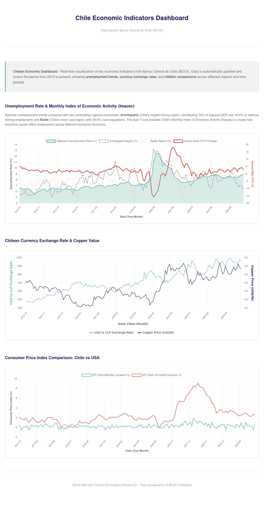

# CLI Tool for Interacting with the Banco Central de Chile (BCCh) API


## General Description
This CLI tool allows you to search, fetch and visualize available data series from the Banco Central de Chile API. Once the data series of interest are identified, you can use their IDs to retrieve the corresponding data in an isolated manner. Also, there are a bunch of predefined sets of series which are used for visualization purposes, starting a local file server that shows different trends or 'insights' from the data.

More information about the API can be found at [BCCh API para Base de Datos Estadísticos](https://si3.bcentral.cl/Siete/es/Siete/API?respuesta=)


## Reason
One of the beauties of Go is its robust and versatile standard library. I noticed a lack of Go-based implementations for the Banco Central de Chile API, and this inspired me to develop a CLI tool as an entry point. This tool provides an easy-to-use interface, acting as a wrapper over the API to simplify data retrieval and interaction. By doing so, I aimed to explore the abstraction ladder of existing CLI libraries, starting from the Go standard library.

This CLI serves as a foundational project, offering an interactive and streamlined experience for users while also opening the door for future enhancements. It simplifies access to the data series, making it an ideal starting stone for developers looking to extend its capabilities or for anyone needing a convenient way to interact with the API. 

## Version Roadmap
The first release (v1.x.x) will rely entirely on the Go standard library. Subsequent versions will incrementally incorporate external libraries.
Here's the roadmap of tools planned to be used:
- v2.x.x [Liner](https://github.com/peterh/liner) for command line editing with history.
- v3.x.x [Cobra](https://github.com/spf13/cobra) for modern Go CLI applications.
- v4.x.x [Bubble Tea](https://github.com/charmbracelet/bubbletea) for interactive CLI applications.
- [VHS](https://github.com/charmbracelet/vhs) for documentation

## 🚀 Quick Start
### Request your [BCCh credentials](https://si3.bcentral.cl/Siete/es/Siete/API?respuesta=)
Create an account with the BCCh (Banco Central de Chile) and activate your API credentials.
### Download the Executable
Visit the Releases section and download the compressed file that matches your OS/architecture setup. Inside the compressed file, you’ll find the executable.
### Start Using the CLI
After unzipping, refer to the executable from your terminal and type commands to get started. Begin with the basics by running:
```bash
<executable-file-name> help
```
*Note: To simplify command usage, you can add the executable to your PATH. This allows you to use a shorter command, such as bcch, instead of specifying the full path each time.*

# BCCh CLI Tool

The **BCCh CLI Tool** provides an interface for interacting with the Banco Central de Chile API, allowing you to set credentials, search for available data series, and retrieve data using specific series IDs.

## 🚀 Installation

Provide installation instructions here, such as:

```sh
go install github.com/iferdel/chile-economic-indexes-cli/bcch@latest
```

Or any other relevant way to install the tool.

## 📚 Usage

### Available Commands

#### `help`
Display help information for any command.

#### `setCredentials`
Save credentials for BCCh API access locally.
- `-u`, `--user` - User for BCCh API
- `-p`, `--password` - Password for BCCh API

#### `search`
Search the full list of available data series, with options to filter by keywords and frequency.
- `-k`, `--keyword` - Filter search results by keyword
- `-f`, `--frequency` - Filter search results by frequency (`DAILY`, `MONTHLY`, `ANNUAL`)
- `--predefined-sets` - List all available predefined sets of series

#### `get`
Retrieve data from a specific data series by series ID.
- `-s`, `--series` - Specify the series ID to retrieve data from

#### `viz`
Opens a local webserver which shows visualizations for a specific set of series from BCCh API.
- `--set` - Specify which set of series to use for visualization (default: EMPLOYMENT)
- `-p`, `--port` - Specify port for the local web server (default: 49966)

### Global Flags

- `-h`, `--help` - Show help for any command

## ⚡ Examples

### Set up Credentials

Save your credentials to be used for BCCh API access:

```bash
bcch setCredentials -u myUser -p myPassword
```

### Search for Data Series

Search for monthly inflation data:

```bash
bcch search -k "inflation" -f MONTHLY

# more than one keyword
bcch search -k "employment" -f ANNUAL -k "China"
```

### Retrieve Data from a Specific Series

Retrieve data using a series ID:

```bash
bcch get -s "12345-inflation-monthly"
```

### Start Local Server For Visualization Dashboard

Launch a local web server with interactive economic indicators dashboard:

```bash
bcch viz
```

This opens a visualization dashboard showing real-time economic data from the BCCh API. The default EMPLOYMENT set includes unemployment trends, currency exchange rates, and inflation comparisons across different Chilean regions.

**Note on AI-Assisted Development:** The chart generation, dashboard design, and static content creation for the visualization feature were developed with extensive Claude assistance. The approach leveraged [data-to-viz](https://www.data-to-viz.com/) as a foundational reference for incorporating chart best practices based on data type, common pitfalls, caveats, and visual styling guidelines. *The biggest goal of this idea was to start the creation of a 'personal' agent which would use this reference to polish charts when needed.* 



## Out of the Box Features
- **Caching for repeated requests:** Reduce API load and improve performance by caching repeated requests.
- **Remember login across new sessions:** Automatically remember login credentials for easier access.
- **Loading spinner to enhance user experience:** Provide visual feedback during data loading to improve user interaction.

## Additional Comments
One major reference in terms of structure and the alike are the [Docker CLI GitHub repository](https://github.com/docker/cli) and [BootDev CLI GitHub repository](https://github.com/bootdotdev/bootdev). CI is managed using GitHub Actions. Releases are handled by [GoReleaser](https://github.com/goreleaser/goreleaser) via [GitHub Actions](https://goreleaser.com/ci/actions/)

## 🤝 Contributing

Follow these steps to get started:

1. **Clone the repository**

   ```sh
   git clone https://github.com/iferdel/chile-economic-indexes-cli@latest
   cd chile-economic-indexes-cli
   ```
   
2. **Build the project**

   ```sh
   go build
   ```

3. **Run the project**

   ```sh
   ./chile-economic-indexes-cli
   ```

4. **Run the tests**

   ```sh
   go test ./...
   ```

5. **Submit a pull request**

   If you'd like to contribute, please fork the repository, make your changes, and open a pull request to the main branch.
